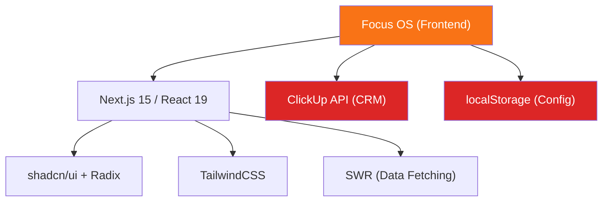
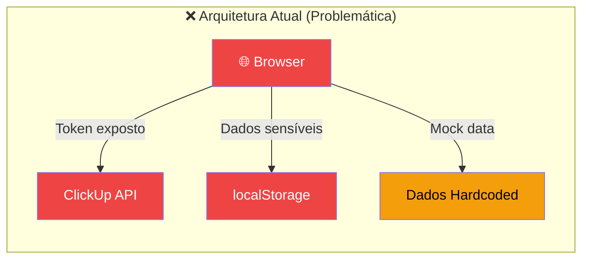
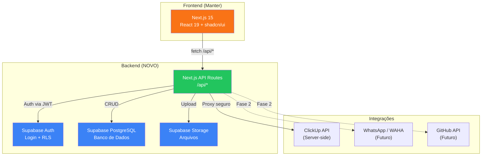
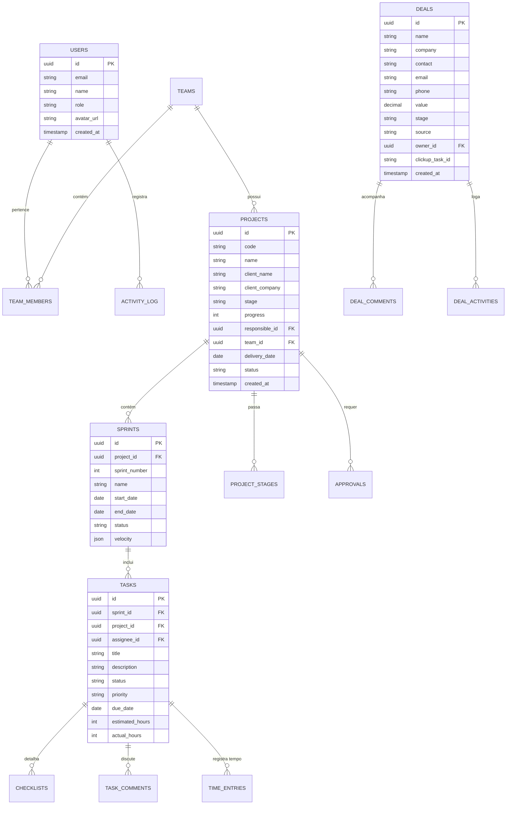
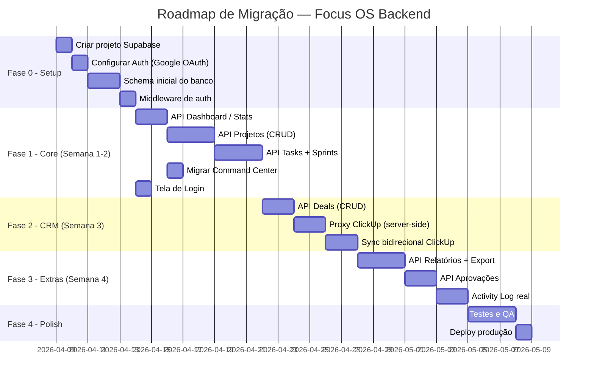
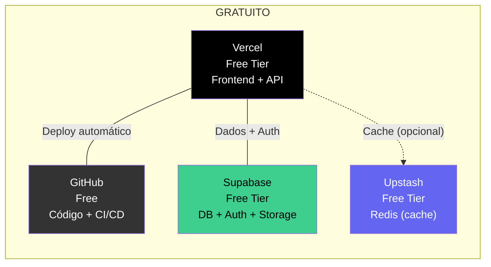
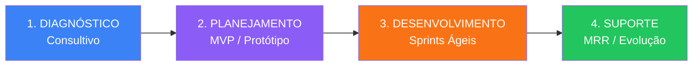

# 🎯 FOCUS OS — Planejamento Backend & Arquitetura
## Reunião Trimestral Q2/2026 · Focus Tecnologias

> **Data:** 08/04/2026 · **Horário:** 18h  
> **Preparado por:** Equipe de Engenharia  
> **Status:** Documento Estratégico para Decisão

---

## 1. DIAGNÓSTICO ATUAL — O que temos hoje

### 1.1 Visão Geral do Focus OS

O **Focus OS** é o sistema operacional interno da Focus Tecnologias, construído com **Next.js 15 + React 19 + TailwindCSS + shadcn/ui**. Ele foi prototipado via v0.dev e expandido localmente.



### 1.2 Módulos Existentes no Frontend

| Módulo | Rota | Status | Dados |
|--------|------|--------|-------|
| Command Center (Dashboard) | `/` | ✅ UI completa | ❌ Mock hardcoded |
| Projetos | `/projetos` | ✅ UI completa | ❌ Mock hardcoded |
| Fluxo de Etapas | `/fluxo` | ✅ UI completa | ❌ Mock hardcoded |
| Sprints | `/sprints` | ✅ UI completa | ❌ Mock hardcoded |
| Tasks | `/tasks` | ✅ UI completa | ❌ Mock hardcoded |
| Checklists | `/checklists` | ✅ UI completa | ❌ Mock hardcoded |
| Aprovações | `/aprovacoes` | ✅ UI completa | ❌ Mock hardcoded |
| Prazos & Entregas | `/prazos` | ✅ UI completa | ❌ Mock hardcoded |
| Backlog | `/backlog` | ✅ UI completa | ❌ Mock hardcoded |
| Comercial / CRM | `/comercial` | ✅ UI completa | ⚠️ ClickUp API (client-side) |
| Intelligence | `/intelligence` | ✅ UI completa | ❌ Mock hardcoded |
| Relatórios | `/relatorios` | ✅ UI completa | ❌ Mock hardcoded |
| Sistemas | `/sistemas` | ✅ UI completa | ❌ Mock hardcoded |
| Agent Network | `/agent-network` | ✅ UI (temática spy) | ❌ Mock hardcoded |
| Operations | `/operations` | ✅ UI completa | ❌ Mock hardcoded |
| Configurações | `/configuracoes` | ✅ UI completa | ⚠️ localStorage |

### 1.3 Integração ClickUp — Única Conexão Real

A integração com ClickUp é a **única fonte de dados real** do sistema. Ela está implementada em:

- [clickup-api.ts](file:///c:/Users/Gabriel/Downloads/v0-focus-OS/lib/clickup-api.ts) — Wrapper da API
- [crm-field-mapper.ts](file:///c:/Users/Gabriel/Downloads/v0-focus-OS/lib/crm-field-mapper.ts) — Mapeador de campos CRM
- [use-clickup.ts](file:///c:/Users/Gabriel/Downloads/v0-focus-OS/hooks/use-clickup.ts) — Hooks React

> [!CAUTION]
> **Problema Crítico de Segurança:** O token da API do ClickUp é armazenado em `localStorage` e as chamadas são feitas **diretamente do navegador do usuário**. Isso expõe o token a qualquer pessoa com acesso ao browser ou a ataques XSS.

---

## 2. O QUE NÃO FAZ SENTIDO HOJE

### 2.1 Problemas Arquiteturais Críticos



| # | Problema | Impacto | Severidade |
|---|---------|---------|------------|
| 1 | **Sem Backend/API própria** | Zero persistência real, sem lógica de negócio server-side | 🔴 Crítico |
| 2 | **Sem Autenticação** | Qualquer pessoa com a URL acessa tudo | 🔴 Crítico |
| 3 | **Token ClickUp no client** | Exposição de credenciais, risco de comprometimento | 🔴 Crítico |
| 4 | **100% dados mock** | 14 de 16 módulos usam dados fictícios | 🔴 Crítico |
| 5 | **Sem banco de dados** | Nenhuma persistência — tudo se perde ao limpar o browser | 🟠 Alto |
| 6 | **Sem multi-tenancy** | Não escala para múltiplos usuários/equipes | 🟠 Alto |
| 7 | **Agent Network temática spy** | Módulo com estética de "espionagem" não condiz com a marca Focus | 🟡 Médio |
| 8 | **Dados da sidebar hardcoded** | Contadores (23 projetos, 89 tasks) são números fixos no código | 🟡 Médio |

### 2.2 O que FUNCIONA e deve ser mantido

| ✅ O que funciona | Por quê |
|-------------------|---------|
| **Design System** | UI premium, dark mode coeso, identidade visual forte (laranja + preto) |
| **Arquitetura de componentes** | shadcn/ui + Radix bem estruturado, componentes reutilizáveis |
| **PWA Support** | Manifest, splash screens, ícones — pronto para instalar |
| **Módulo CRM (lógica)** | Mapeamento de campos, pipeline, métricas — lógica sólida |
| **Sistema de módulos** | `ModulesContext` permite ligar/desligar módulos dinamicamente |
| **Layout responsivo** | Mobile sidebar, desktop sidebar colapsável, grid adaptativo |
| **Report builder** | Tipos, seções, configuração — estrutura pronta para geração de relatórios |

---

## 3. ARQUITETURA PROPOSTA — Backend Focus OS

### 3.1 Arquitetura de Alto Nível



### 3.2 Por que esta arquitetura?

> [!IMPORTANT]
> **Decisão: Usar Next.js API Routes + Supabase** em vez de um backend separado.

| Critério | Decisão | Justificativa |
|----------|---------|---------------|
| **Custo** | Supabase Free Tier | 0 custo: 500MB DB, 1GB storage, 50k auth users, 2M edge functions |
| **Complexidade** | API Routes no mesmo projeto | Sem deploy separado, sem CORS, sem Docker (por enquanto) |
| **Auth** | Supabase Auth + RLS | Google OAuth, magic link, JWT — tudo pronto |
| **Banco** | PostgreSQL (Supabase) | Padrão da indústria, Row Level Security nativo |
| **Deploy** | Vercel Free Tier | 100GB bandwidth, serverless, CD automático via GitHub |
| **Velocidade** | MAX | Pode ser implementado em 2-4 semanas |

### 3.3 Comparação com Alternativas

| Opção | Custo | Complexidade | Velocidade de Entrega | Veredicto |
|-------|-------|-------------|----------------------|-----------|
| **Next.js API + Supabase** ⭐ | R$ 0 | Baixa | 2-4 semanas | ✅ RECOMENDADO |
| Fastify/Express + PostgreSQL | R$ 0-50/mês | Média | 4-6 semanas | ⚠️ Viável, mais controle |
| NestJS + Prisma + PlanetScale | R$ 0-30/mês | Alta | 6-8 semanas | ❌ Over-engineering para o momento |
| Firebase (Full) | R$ 0 (free tier) | Baixa | 2-3 semanas | ⚠️ Lock-in Google, NoSQL |

---

## 4. MODELO DE DADOS — Schema do Banco

### 4.1 Entidades Principais



### 4.2 Tabelas Detalhadas

| Tabela | Descrição | Registros Estimados (início) |
|--------|-----------|------------------------------|
| `users` | Usuários do sistema (auth via Supabase) | 5-15 |
| `teams` | Equipes/departamentos | 3-5 |
| `team_members` | Relação user ↔ team | 15-30 |
| `projects` | Projetos de clientes | 20-50 |
| `project_stages` | Histórico de etapas do projeto | 100-200 |
| `sprints` | Sprints dentro de cada projeto | 50-100 |
| `tasks` | Tarefas dentro das sprints | 500-2000 |
| `checklists` | Itens de checklist por task | 1000-5000 |
| `task_comments` | Comentários em tasks | 500-2000 |
| `time_entries` | Registros de tempo (futuro) | 1000-5000 |
| `approvals` | Aprovações pendentes | 50-200 |
| `deals` | Leads/deals do CRM | 50-200 |
| `deal_activities` | Atividades por deal | 200-1000 |
| `activity_log` | Log geral de atividades | 5000+ |
| `reports` | Relatórios gerados | 50-200 |
| `settings` | Configurações do sistema | 20-50 |
| `integrations` | Dados de integrações (ClickUp, etc) | 5-10 |

---

## 5. API ROUTES — Estrutura de Endpoints

### 5.1 Organização das Rotas

```
app/
├── api/
│   ├── auth/
│   │   ├── login/route.ts          # POST - Login
│   │   ├── signup/route.ts         # POST - Cadastro
│   │   ├── me/route.ts             # GET - Usuário atual
│   │   └── callback/route.ts       # GET - OAuth callback
│   │
│   ├── projects/
│   │   ├── route.ts                # GET (listar) / POST (criar)
│   │   ├── [id]/route.ts           # GET / PUT / DELETE
│   │   ├── [id]/sprints/route.ts   # GET / POST
│   │   ├── [id]/stages/route.ts    # GET / POST
│   │   └── [id]/report/route.ts    # POST (gerar relatório)
│   │
│   ├── sprints/
│   │   ├── route.ts                # GET (listar ativas)
│   │   ├── [id]/route.ts           # GET / PUT
│   │   └── [id]/tasks/route.ts     # GET / POST
│   │
│   ├── tasks/
│   │   ├── route.ts                # GET (listar) / POST
│   │   ├── [id]/route.ts           # GET / PUT / DELETE
│   │   ├── [id]/comments/route.ts  # GET / POST
│   │   └── [id]/checklist/route.ts # GET / POST / PUT
│   │
│   ├── deals/
│   │   ├── route.ts                # GET / POST
│   │   ├── [id]/route.ts           # GET / PUT / DELETE
│   │   ├── [id]/activities/route.ts # GET / POST
│   │   ├── pipeline/route.ts       # GET (métricas)
│   │   └── sync/route.ts           # POST (sync ClickUp)
│   │
│   ├── team/
│   │   ├── route.ts                # GET / POST
│   │   └── [id]/members/route.ts   # GET / POST / DELETE
│   │
│   ├── dashboard/
│   │   ├── stats/route.ts          # GET (KPIs)
│   │   ├── activity/route.ts       # GET (log)
│   │   └── approvals/route.ts      # GET / PUT
│   │
│   ├── reports/
│   │   ├── route.ts                # GET / POST
│   │   └── [id]/export/route.ts    # POST (PDF/Docs)
│   │
│   └── integrations/
│       ├── clickup/
│       │   ├── config/route.ts     # GET / PUT
│       │   ├── sync/route.ts       # POST
│       │   └── webhook/route.ts    # POST (receber eventos)
│       └── webhooks/route.ts       # GET / POST
```

### 5.2 Middleware de Autenticação

```typescript
// middleware.ts (simplificado)
import { createMiddlewareClient } from '@supabase/auth-helpers-nextjs'

export async function middleware(req) {
  // Proteger todas as rotas /api/* exceto /api/auth/*
  // Proteger todas as páginas exceto /login
  // Verificar JWT do Supabase
  // Injetar user no request
}
```

---

## 6. ESTRATÉGIA DE MIGRAÇÃO — Do Mock para Real

### 6.1 Fases de Implementação



### 6.2 Prioridade de Migração por Módulo

| Prioridade | Módulo | Esforço | Valor para o Negócio |
|------------|--------|---------|---------------------|
| 🥇 P0 | **Auth + Login** | 1-2 dias | Sem isso, nada funciona |
| 🥇 P0 | **Dashboard (stats reais)** | 2 dias | Centro de comando real |
| 🥈 P1 | **Projetos + Sprints** | 5 dias | Core do negócio |
| 🥈 P1 | **Tasks** | 3 dias | Operação diária |
| 🥉 P2 | **CRM / Comercial** | 4 dias | Receita |
| 🥉 P2 | **Relatórios para cliente** | 3 dias | Diferencial competitivo |
| 📦 P3 | **Backlog** | 2 dias | Planejamento |
| 📦 P3 | **Aprovações** | 2 dias | Processo |
| 📦 P3 | **Intelligence** | 3 dias | Dados estratégicos |
| ❄️ P4 | **Agent Network** | — | Remover ou reestruturar |

---

## 7. INFRAESTRUTURA — Stack Gratuita Recomendada

### 7.1 Stack de Custo Zero



### 7.2 Limites do Free Tier

| Serviço | Limite Free | Suficiente? | Upgrade (quando precisar) |
|---------|------------|-------------|--------------------------|
| **Vercel** | 100GB bandwidth, Serverless | ✅ Sim, para 5-20 users | Pro $20/mês |
| **Supabase** | 500MB DB, 1GB storage, 50k auth | ✅ Sim, por ~ 6-12 meses | Pro $25/mês |
| **GitHub** | Ilimitado (private repos) | ✅ Sim | — |
| **Upstash Redis** | 10k cmds/dia, 256MB | ✅ Sim (cache) | Pay-per-use |

> [!TIP]
> **Estimativa:** A Focus OS pode rodar **gratuitamente por 6-12 meses** com a equipe atual (5-15 usuários). O custo só aparece quando escalar para 50+ projetos simultâneos com uploads pesados.

### 7.3 Ambientes

| Ambiente | URL | Branch | Propósito |
|----------|-----|--------|----------|
| **Produção** | `focusos.vercel.app` | `main` | Equipe usa diariamente |
| **Staging** | `focusos-staging.vercel.app` | `develop` | Testar antes de mergear |
| **Preview** | `focusos-pr-XX.vercel.app` | PRs | Cada PR gera um ambiente |

---

## 8. ADAPTAÇÃO PARA FOCUS TECNOLOGIAS

### 8.1 Branding & Identidade

| Item | Atual | Proposta |
|------|-------|---------|
| Nome do produto | "FOCUS PROJECT OS" | ✅ Manter |
| Versão | v3.0 CLASSIFIED | **v1.0 — Focus OS** (mais sério) |
| Tema | Dark mode (laranja + preto) | ✅ Manter (alinhado com a marca Focus) |
| Fontes | Syne + DM Sans + JetBrains Mono | ✅ Manter |
| Logo | `/logo.svg` | Confirmar que é o logo oficial Focus |

### 8.2 Módulos que Devem Ser Adaptados

| Módulo | Adaptação Necessária |
|--------|---------------------|
| **Agent Network** | ❌ **REMOVER** — temática de espionagem não condiz com a Focus. Substituir por um módulo "Equipe" real com dados de alocação por projeto |
| **Command Center** | 🔄 Adaptar para mostrar dados reais da Focus: projetos ativos, tasks pendentes, pipeline comercial real |
| **Comercial/CRM** | ✅ Já está alinhado — manter integração com ClickUp, adicionar backend |
| **Relatórios** | 🔄 Adicionar logo Focus nos exports, personalizar com dados do cliente da Focus |
| **Operations** | 🔄 Revisar para alinhar com o fluxo real de operações (Diagnóstico → MVP → Dev → Suporte) |

### 8.3 Fluxo de Trabalho Focus (Do site www.focustecnologias.com.br)

O Focus OS deve refletir o processo real da empresa conforme descrito no site:



**Mapeamento para o Focus OS:**

| Etapa do Site | Módulo no Focus OS | Status |
|---------------|-------------------|--------|
| Diagnóstico Consultivo | Projetos → Stage "Diagnóstico" | ✅ Existe |
| Planejamento e MVP | Projetos → Stage "MVP / Protótipo" | ✅ Existe |
| Proposta e Fechamento | Comercial / CRM | ✅ Existe |
| Sprints de Desenvolvimento | Sprints + Tasks | ✅ Existe |
| Deploy e Entrega | Projetos → Stage "Deploy" | ✅ Existe |
| Suporte Recorrente (MRR) | Projetos → Stage "Suporte" | ✅ Existe |

> [!NOTE]
> O frontend já reflete os estágios corretos do fluxo da Focus (visível no Command Center, seção "Visão Geral de Projetos"). O que falta é **dados reais** por trás.

---

## 9. DECISÕES PARA A REUNIÃO

### 9.1 Decisões Necessárias Hoje

| # | Decisão | Opções | Recomendação |
|---|---------|--------|-------------|
| 1 | **Começar o backend?** | Sim / Não / Adiar | ✅ **Sim, agora** |
| 2 | **Stack do backend?** | Next.js API Routes + Supabase / Backend separado | ✅ **Next.js + Supabase** |
| 3 | **Quem desenvolve?** | Gabriel sozinho / Gabriel + estagiário / Outsource | Depende da capacidade |
| 4 | **Prazo para v1 funcional?** | 2 sem / 4 sem / 6 sem | ✅ **4 semanas** (equilibrado) |
| 5 | **Remover Agent Network?** | Sim / Adaptar | ✅ **Remover e substituir por "Equipe"** |
| 6 | **Manter ClickUp como CRM?** | Sim (sync) / Migrar tudo para Focus OS | ✅ **Manter sync duplo** (ClickUp + DB local) |
| 7 | **Domínio personalizado?** | focusos.focustecnologias.com.br / app.focustecnologias.com.br | Qualquer um (Vercel suporta grátis) |

### 9.2 Quick Wins — Pode ser feito esta semana

| Quick Win | Esforço | Impacto |
|-----------|---------|---------|
| Criar projeto Supabase e schema | 2h | Base para tudo |
| Adicionar tela de login | 3h | Segurança básica |
| Mover token ClickUp para env vars + API Route | 2h | Resolver problema de segurança |
| Substituir Agent Network por módulo "Equipe" | 2h | Alinhar com a marca |

---

## 10. RISCOS E MITIGAÇÕES

| Risco | Probabilidade | Impacto | Mitigação |
|-------|--------------|---------|-----------|
| Supabase free tier insuficiente | Baixa (6-12m) | Médio | Monitorar uso, upgrade é barato ($25/mês) |
| Vercel free tier rate limiting | Baixa | Médio | Hobby é generoso para apps internos |
| Complexidade de migração do mock → real | Média | Alto | Fazer módulo por módulo, manter mocks como fallback |
| Gabriel como single point of failure | Alta | Crítico | Documentar tudo, pair programming com estagiário |
| Perda de dados (sem backup) | Média | Crítico | Supabase tem backups automáticos, GitHub para código |

---

## 11. MÉTRICAS DE SUCESSO

| Métrica | Baseline (Hoje) | Target (Q3/2026) |
|---------|-----------------|-------------------|
| Módulos com dados reais | 1/16 (6%) | 8/16 (50%) |
| Tempo para gerar relatório de cliente | Manual (~2h) | Automatizado (~5min) |
| Usuários ativos no sistema | 0 (ninguém usa) | 5+ (equipe inteira) |
| Uptime do sistema | Apenas local | 99%+ (Vercel) |
| Vulnerabilidades de segurança | 3 críticas | 0 |

---

## 12. RESUMO EXECUTIVO

> [!IMPORTANT]
> ### O que temos
> Um **frontend excelente** com UI premium, 16 módulos e design coeso — mas **zero backend funcional**. É um protótipo visual avançado.
> 
> ### O que precisamos
> Um **backend leve com Next.js API Routes + Supabase** (custo zero) para transformar o protótipo em ferramenta real que a equipe use diariamente.
> 
> ### Quanto custa
> **R$ 0/mês** por 6-12 meses. Depois, ~R$ 125/mês (Vercel Pro + Supabase Pro).
> 
> ### Quanto tempo
> **4 semanas** para MVP funcional (auth + projetos + tasks + CRM).
> 
> ### Maior risco
> Gabriel como única pessoa técnica. Solução: documentação + pair programming.

---

*Documento gerado para a Reunião Trimestral Q2/2026 — Focus Tecnologias*  
*Instagram: @focustech.co · www.focustecnologias.com.br*  
*Rua Barbosa de Freitas 1741, Aldeota, Fortaleza, CE*
